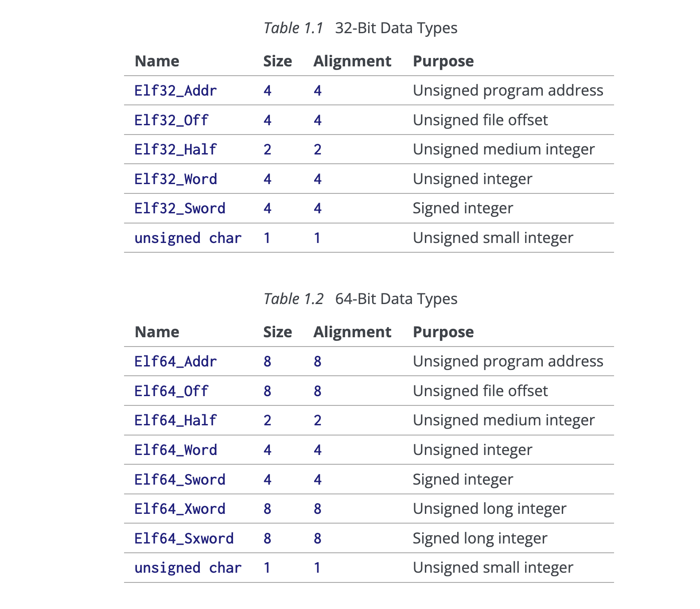
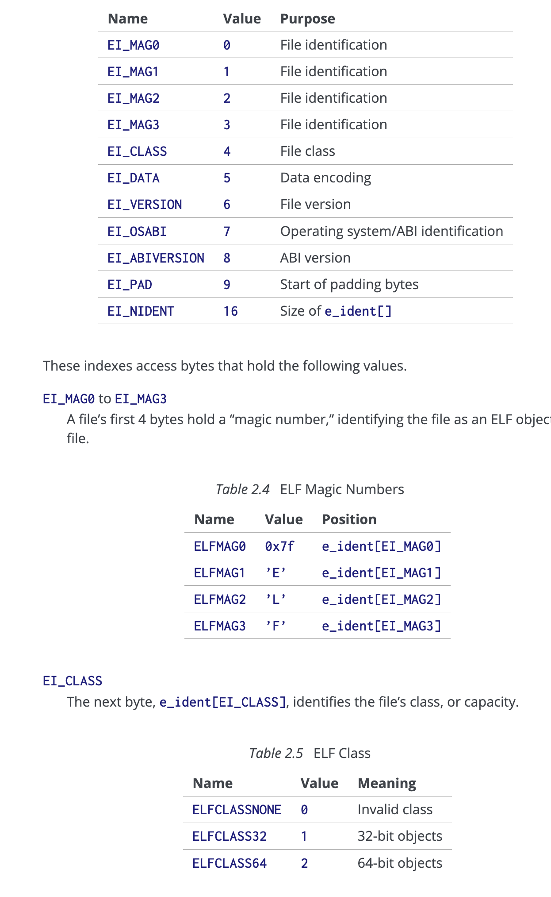

# 📘 Study Notes — ELF Files

> My own notes first, then a cleaned-up copy of the reference article for comfortable reading.

---

## 🗒️ My Notes

### ELF: Executable and Linking Format file

Has headers *(contain info about the file — metadata)*.

- **Segments** → portions of instructions that will be executed
- **Sections** → portions of instructions related to linked libraries

**ABI** → Application Binary Interface

| Component | Description |
| --- | --- |
| **ELF Header** | Contains metadata about the file, such as its type, architecture, and entry point. |
| **Program Header Table** | Describes segments used at runtime (like code and data). |
| **Section Header Table** | Describes sections used for linking and debugging (like symbol tables and relocation information). |
| **Sections and Segments** | Contain the actual data, such as code, data, symbols, and debug information. |

> 🔗 **Reference:** <https://dev.to/bytehackr/understanding-the-basics-of-elf-files-on-linux-61c>

---

# 📄 Article — Understanding the Basics of ELF Files on Linux

`#security` · `#linux` · `#hacking` · `#malware`

The Executable and Linkable Format (ELF) is the standard file format for executables, object code, shared libraries, and core dumps on Linux and Unix-like systems. Understanding ELF files is essential for anyone involved in software development, reverse engineering, or security analysis on Linux systems. This blog will walk you through the basics of ELF files, their structure, and how to analyze them.

### Contents

- [📘 Study Notes — ELF Files](#-study-notes--elf-files)
  - [🗒️ My Notes](#️-my-notes)
    - [ELF: Executable and Linking Format file](#elf-executable-and-linking-format-file)
- [📄 Article — Understanding the Basics of ELF Files on Linux](#-article--understanding-the-basics-of-elf-files-on-linux)
    - [Contents](#contents)
  - [Introduction to ELF Files](#introduction-to-elf-files)
  - [Structure of an ELF File](#structure-of-an-elf-file)
  - [ELF Header: The File's Metadata](#elf-header-the-files-metadata)
  - [Program Header Table: Runtime Segments](#program-header-table-runtime-segments)
  - [Section Header Table: Linking and Debugging Information](#section-header-table-linking-and-debugging-information)
  - [Analyzing ELF Files](#analyzing-elf-files)
    - [🔧 readelf](#-readelf)
    - [🔧 objdump](#-objdump)
    - [🔧 nm](#-nm)
    - [🔧 strace](#-strace)
  - [Common ELF File Issues \& Malwares](#common-elf-file-issues--malwares)
    - [How File Packing Works](#how-file-packing-works)
    - [The Role of UPX](#the-role-of-upx)
    - [Recognizing and Unpacking Packed ELF Files](#recognizing-and-unpacking-packed-elf-files)
  - [Windows vs. Linux: PE vs. ELF](#windows-vs-linux-pe-vs-elf)
  - [Headers presentation:](#headers-presentation)
  - [Packer tutorial for windows, I beleive it will be really helpful](#packer-tutorial-for-windows-i-beleive-it-will-be-really-helpful)
  - [text segment](#text-segment)
  - [|              |](#--------------)

---

## Introduction to ELF Files

ELF files are central to the functioning of Linux systems. They are used to define how the operating system loads and runs programs, including how they link to shared libraries. The ELF format is flexible, allowing it to be used for different kinds of files, such as executables, object files, and shared libraries.

**Key Characteristics of ELF Files:**

- **Portability** — ELF is used across various Unix-like systems.
- **Extensibility** — Supports dynamic linking, allowing code to be shared between programs.
- **Efficiency** — Designed to be loaded and executed quickly by the operating system.

---

## Structure of an ELF File

An ELF file is composed of several sections and segments that define the executable's code, data, and other resources. The main components of an ELF file are:

- **ELF Header** — Contains metadata about the file, such as its type, architecture, and entry point.
- **Program Header Table** — Describes segments used at runtime (like code and data).
- **Section Header Table** — Describes sections used for linking and debugging (like symbol tables and relocation information).
- **Sections and Segments** — Contain the actual data, such as code, data, symbols, and debug information.

Here's a simplified view of an ELF file structure:

```text
+-----------------+
| ELF Header      |
+-----------------+
| Program Headers |
+-----------------+
| Sections        |
+-----------------+
| Segment Data    |
+-----------------+
| Section Headers |
+-----------------+
```

---

## ELF Header: The File's Metadata

The ELF header is the first part of the ELF file and provides the essential metadata for the operating system to understand how to process the file.

**Key fields in the ELF Header:**

| Field | Meaning |
| --- | --- |
| `e_ident` | A magic number identifying the file as an ELF file. |
| `e_type` | Identifies the file type (e.g., executable, shared object, or relocatable). |
| `e_machine` | Specifies the target architecture (e.g., x86_64, ARM). |
| `e_version` | The version of the ELF format. |
| `e_entry` | The memory address of the entry point, where the process starts executing. |
| `e_phoff` | Offset to the program header table. |
| `e_shoff` | Offset to the section header table. |

---

## Program Header Table: Runtime Segments

The program header table is crucial during the execution of the program. It tells the loader which parts of the file should be loaded into memory and how.

**Key fields in a Program Header:**

| Field | Meaning |
| --- | --- |
| `p_type` | The type of segment (e.g., LOAD, DYNAMIC). |
| `p_offset` | The offset of the segment in the file. |
| `p_vaddr` | The virtual address where the segment should be loaded. |
| `p_paddr` | The physical address (not always used). |
| `p_filesz` | The size of the segment in the file. |
| `p_memsz` | The size of the segment in memory. |

**Common segment types include:**

- **LOAD** — Contains code or data that should be loaded into memory.
- **DYNAMIC** — Holds dynamic linking information.
- **INTERP** — Contains the name of the dynamic linker.

---

## Section Header Table: Linking and Debugging Information

The section header table is used primarily for linking and debugging. It contains entries that describe sections of the file, such as the `.text` section (executable code) or the `.data` section (initialized data).

**Key fields in a Section Header:**

| Field | Meaning |
| --- | --- |
| `sh_name` | The name of the section. |
| `sh_type` | The type of section (e.g., SHT_PROGBITS for code/data). |
| `sh_flags` | Flags indicating the section's attributes (e.g., SHF_EXECINSTR for executable code). |
| `sh_addr` | The virtual address where the section should be loaded. |
| `sh_offset` | Offset of the section in the file. |
| `sh_size` | Size of the section. |

**Common sections include:**

| Section | Contents |
| --- | --- |
| `.text` | Contains the executable code. |
| `.data` | Contains initialized data. |
| `.bss` | Contains uninitialized data. |
| `.symtab` | Symbol table used by the linker. |
| `.strtab` | String table used by the symbol table. |
| `.rel.text` | Relocation information for the `.text` section. |

---

## Analyzing ELF Files

There are various tools available to analyze ELF files. Here are a few commonly used ones:

### 🔧 readelf

`readelf` is a command-line utility that displays information about ELF files. It can show headers, sections, segments, symbols, and more.

```sh
readelf -h <file>   # Display the ELF header
readelf -l <file>   # Display the program header
readelf -S <file>   # Display the section header table
```

> 🖼️ *Example of an ELF Header (image in original article).*

### 🔧 objdump

`objdump` is another powerful tool for examining the contents of object files, including ELF files. It can disassemble executables, display symbol tables, and more.

```sh
objdump -d <file>   # Disassemble the executable code
objdump -t <file>   # Display the symbol table
```

### 🔧 nm

`nm` is used to list symbols from object files. It's useful for developers to understand the functions and variables in an ELF file.

```sh
nm <file>   # List symbols
```

### 🔧 strace

`strace` traces system calls and signals, which can be helpful in understanding the runtime behavior of an ELF executable.

```sh
strace ./<executable>   # Trace the system calls made by the executable
```

---

## Common ELF File Issues & Malwares

While working with ELF files, you may encounter various issues, such as:

- **Broken dependencies** — Missing shared libraries can cause an executable to fail.
- **Relocation errors** — Errors in the relocation process during dynamic linking.
- **Corrupted ELF files** — Corruption in the ELF file structure can cause the loader to fail.

Sometime malware authors often use file packing techniques to evade detection. Packing involves compressing or encrypting an ELF file, obscuring its contents from traditional inspection methods.

### How File Packing Works

File packing compresses or encrypts the ELF file, making it difficult to analyze. When executed, the malware decompresses itself in memory, revealing its true nature. This dynamic unpacking complicates static analysis and requires sophisticated tools and techniques to fully understand the malware's behavior.

### The Role of UPX

One popular packing tool is the Ultimate Packer for eXecutables (UPX). UPX is widely used by malware authors to compress ELF files, reducing their size and altering their structure to thwart reverse engineering.

### Recognizing and Unpacking Packed ELF Files

To detect packed ELF files, investigators look for anomalies such as irregular section sizes or high entropy levels. Unpacking typically involves dynamic analysis, where the malware is executed in a controlled environment to capture the unpacked code in memory.

Understanding and unpacking these techniques is essential for incident responders to analyze the malware effectively and develop appropriate countermeasures.

---

## Windows vs. Linux: PE vs. ELF

While both Windows and Linux use different executable formats, there are notable differences between the PE (Portable Executable) file format used by Windows and the ELF format used by Linux.

**Key Differences:**

| Format | Header details |
| --- | --- |
| **PE Header** (Windows) | Includes DOS headers, PE signatures, and COFF headers, which are specific to Windows executables. |
| **ELF Header** (Linux) | Contains identification information, file type, and architecture, leading to program and section header tables that facilitate dynamic linking and execution on Unix-like systems. |

Understanding these differences is crucial for cross-platform malware analysis and digital investigations.

---

## Headers presentation:
Ref: https://gabi.xinuos.com/elf/02-eheader.html

#define EI_NIDENT 16

typedef struct {
        unsigned char   e_ident[EI_NIDENT];
        Elf32_Half      e_type;
        Elf32_Half      e_machine;
        Elf32_Word      e_version;
        Elf32_Addr      e_entry;
        Elf32_Off       e_phoff;
        Elf32_Off       e_shoff;
        Elf32_Word      e_flags;
        Elf32_Half      e_ehsize;
        Elf32_Half      e_phentsize;
        Elf32_Half      e_phnum;
        Elf32_Half      e_shentsize;
        Elf32_Half      e_shnum;
        Elf32_Half      e_shstrndx;
} Elf32_Ehdr;

typedef struct {
        unsigned char   e_ident[EI_NIDENT];
        Elf64_Half      e_type;
        Elf64_Half      e_machine;
        Elf64_Word      e_version;
        Elf64_Addr      e_entry;
        Elf64_Off       e_phoff;
        Elf64_Off       e_shoff;
        Elf64_Word      e_flags;
        Elf64_Half      e_ehsize;
        Elf64_Half      e_phentsize;
        Elf64_Half      e_phnum;
        Elf64_Half      e_shentsize;
        Elf64_Half      e_shnum;
        Elf64_Half      e_shstrndx;
} Elf64_Ehdr;







## Packer tutorial for windows, I beleive it will be really helpful

https://github.com/frank2/packer-tutorial


Why not write an executable file myself??

A program can work without section headers, Section headers can be tampered or removed -> this will make gdb, objdump, objcpy usless

.text section is within the range of text segment


text segment 
----------------
|              |
|              |
| .text section|
|              |
|              |
----------------


SHT_PROGBITS: Section Header Type Program Bits (Which means this section header contains the actual program bits)
SHT_NOBITS: like the .bss which holds the unintialized global variables, it takes 4 bytes only on disk
SHT_DYSYM: dynamic sympols for has something to do with dynamic linking
SHT_REL: relocation section , has something to do with dynamic linking
SHT_SYMTAB: symbol

-The journey was certainly interesting but also painful, frustrating, and long
- All programs that run on computer are just binaries (0s/1s) that you read as 0 and 1 strings, it's save in a file called binary file, when the cpu proccess it, it executes the instructions and uses the data to make the program happen (Question: is it the same case in project/program/portfolio managment shall we write the project details so however take it can execute it)